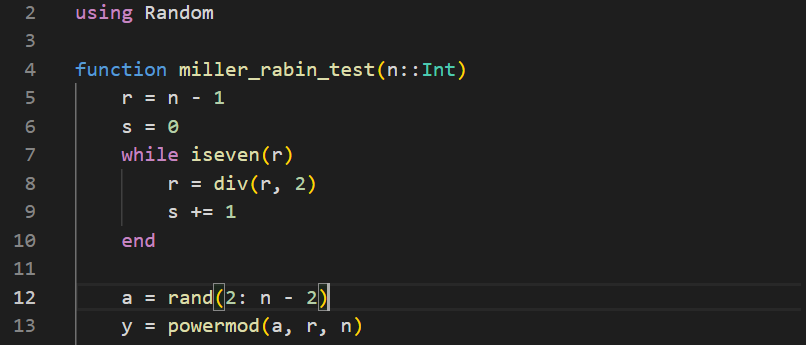

  <h1><strong>Лабораторная Pабота No 5</strong></h1>
  <h2><strong>Математические Основы Защиты Информации и Информационной Безопасности</strong></h2>
  <h2>Хосе Фернандо Леон Атупанья | НФИмд-01-24</h2>

## **Содержание**

1. Цель работы
2. Выполнение лабораторной работы
3. Выводы

## **1. Цель работы**

Вычислить максимальный общий делитель, используя алгоритмы, представленные в лабораторном рабочем материале 5.

## **2. Выполнение лабораторной работы**

### *2.1 Алгоритм, реализующий тест Ферма*

В этой отчете реализуем тест Ферма на простоту, вероятностный алгоритм, используемый для проверки того, является ли число простым. Тест основан на Малой теореме Ферма, которая предполагает, что если число n составное.

Эта строка импортирует модуль Random, который предоставляет функции для генерации случайных чисел. Эта функция, fermat_primality_test, принимает целое число n в качестве входных данных. Цель этой функции - определить, является ли входное целое число n простым, используя вероятностный тест Ферма.Функция также проверяет, является ли число n четным, используя значение even(n). Четные числа (кроме 2) не являются простыми.

Эта строка генерирует случайное целое число a в диапазоне [2, n-2], модуль мощности(a, n - 1, n) эффективно вычисляет значение a^(n-1) (mod n). Если r равно 1, тест Ферма предполагает, что n может быть простым, поэтому функция возвращает "Число n, вероятно, простое". Иначе "Число n составное".

Он отображает сообщение с приглашением, а затем считывает вводимые пользователем данные с помощью функции readline().

Затем введенная строка преобразуется в целое число с помощью синтаксического анализа (Int, n) и сохраняется в num1. Мы вызываем нашу функцию с аргументом num1, чтобы получить результат.

OUTPUT:

### *2.2 Алгоритм вычисления символа Якоби*

Вычислите символ Якоби (n/a), важную функцию в теории чисел, часто используемую в алгоритмах, связанных с проверкой на простоту и квадратичными вычетами. Символ Якоби обобщает символ Лежандра и может быть вычислен для любого целого числа a и любого положительного нечетного числа n.

Функция jacobi_symbol принимает два целочисленных входных сигнала, a и n. Если a равно 1, функция возвращает g как символ Якоби. (1/n) всегда равно 1 для любых нечетных n.

Этот цикл удаляет все множители, равные 2, из a, многократно деля его на 2, пока оно не станет нечетным. Значение s зависит от того, сколько раз a было разделено на 2:
Если k (количество делений на 2) четное, s остается равным 1. Если k нечетное, s зависит от значения n (mod 8).

Если a1 равно 1, то результатом вычисления символа Якоби будет просто произведение g * s, и функция вернет это значение. Функция применяет закон квадратичной взаимности, который изменяет s в зависимости от значений a1 и n по модулю 4. После настройки s и обновления a и n функция вызывает саму себя рекурсивно с a = n % a1 и n = a1.

jacobi_symbol(num1, num2) вызывает символьную функцию Якоби с предоставленными входными данными.

OUTPUT:

### *2.3 Алгоритм, реализующий тест Соловэя-Штрасеена*

Этот код реализует тест на простоту Соловея-Штрассена, вероятностный алгоритм, используемый для проверки вероятности того, что число является простым. Тест основан на свойствах символов Якоби и модульной арифметике.

Тест Соловея-Штрассена основан на выборе случайной базы для проведения вероятностного тестирования на первичность. Эта функция вычисляет символ Якоби (n/a) для заданных целых чисел a и n. Символ Якоби имеет решающее значение для сравнения свойств a относительно n в тесте.

Эта часть делит a на 2 до тех пор, пока оно не станет нечетным, считая деления в k. Если k нечетно, а n по модулю 8 равно 3 или 5, значение s равно -1; в противном случае значение s остается равным 1. Это условие применяет закон квадратичной взаимности, который регулирует s на основе значений n и a1 по модулю 4.

Он проверяет, является ли n допустимым входным значением (нечетное целое число, большее или равное 5). Если r не равно ни 1, ни n−1, функция делает вывод, что n является составным. Если r (mod n) не равно s, то n является составным. Если они равны, то n "вероятно, простое число".

Функция solovay_strassen_test вызывается с номером 1, и результат выводится на печать.

OUTPUT:

### *2.4 Алгоритм, реализующий тест Миллера-Рабина*

Этот код реализует тест на простоту Миллера-Рабина, вероятностный алгоритм, используемый для определения того, является ли данное целое число n простым.

Функция miller_rabin_test принимает целое число n в качестве входных данных для проверки на примитивность. Функция переписывает n−1 в виде 2^s*r, где r - нечетное число, а s - неотрицательное целое число.

В этом цикле:
y возводится в квадрат по модулю n с точностью до s−1 раз. Если в какой-либо точке y становится равным 1, функция делает вывод, что n является составным, поскольку это значение указывает на сбой в выполнении условия Миллера-Рабина. Если y достигает n−1 до завершения цикла, тест рассматривает этот экземпляр как потенциально простой и завершает цикл.

Если все проверки пройдены, функция возвращает "Число n, вероятно, простое". Поскольку тест является вероятностным, он не гарантирует простоту, а только то, что n, вероятно, простое.

Выводится результат теста, либо "вероятно, простой", либо "сложный".

OUTPUT:

## 3. Выводы

Каждый алгоритм обеспечивает различный баланс скорости и точности, при этом алгоритм Миллера-Рабина, как правило, является наиболее надежным для практического использования, особенно когда надежность имеет решающее значение. Тест Ферма, хотя и быстрый, более уязвим к ошибкам при работе с определенными составными числами, и метод Соловея-Штрассена находится между ними, предлагая разумный компромисс. Комбинирование этих методов или использование метода Миллера-Рабина с несколькими итерациями может обеспечить высокий уровень достоверности результата.

Для практических целей тест Миллера-Рабина часто является предпочтительным из-за его эффективности и высокой точности, особенно для приложений в криптографии, где важна простота.

