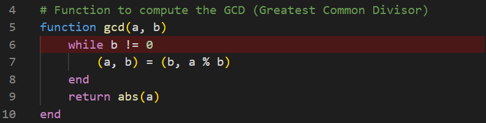
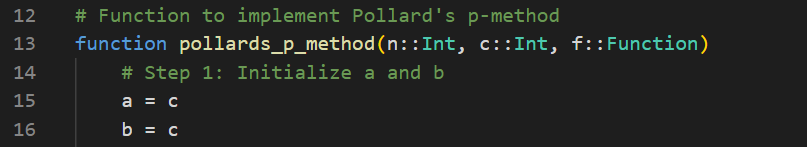
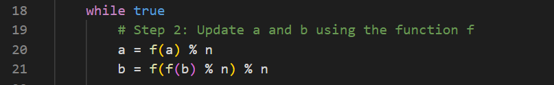
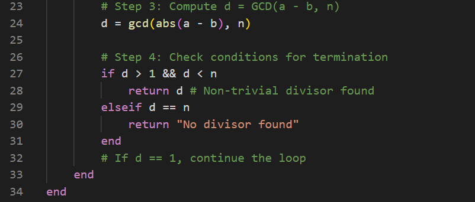
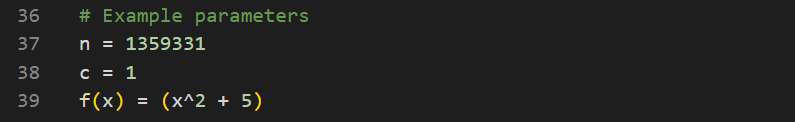
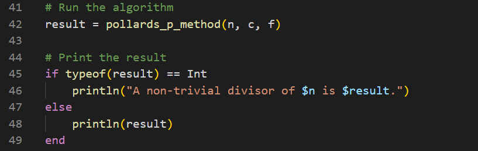

  <h1><strong>Лабораторная Pабота No 6</strong></h1>
  <h2><strong>Математические Основы Защиты Информации и Информационной Безопасности</strong></h2>
  <h2>Хосе Фернандо Леон Атупанья | НФИмд-01-24</h2>

## **Содержание**

1. Цель работы
2. Выполнение лабораторной работы
3. Выводы

## **1. Цель работы**

Ознакомиться с алгоритмом разложения чисел на множители. И написать код, соответствующий этому процессу (лабораторная работа 6).

## **2. Выполнение лабораторной работы**

### *Алгоритм, реализующий p-метод Полладла*

В этой отчете следующий код реализует p-метод Полларда для целочисленной факторизации. Этот алгоритм определяет нетривиальный множитель заданного целого числа n, используя псевдослучайную функцию f(x) со сжимающими свойствами. Ниже приведена подробная реализация в Julia с последующим объяснением.

Функция GCD:

Вспомогательная функция gcd(a, b) определена для вычисления наибольшего общего делителя двух целых чисел с использованием евклидова алгоритма.

Функция p-метода Полларда:

Основная функция pollards_p_method(n, c, f) принимает в качестве входных данных:
n: число для разложения на множители.
c: Начальное значение для алгоритма
f: Псевдослучайная функция сжатия.

Затем введенная строка преобразуется в целое число с помощью синтаксического анализа (Int, n) и сохраняется в num1. Мы вызываем нашу функцию с аргументом num1, чтобы получить результат.

Алгоритм итеративно вычисляет обновления для переменных
a и b, используя функцию f(x). Переменная b обновляется дважды за итерацию, чтобы обеспечить необходимое расхождение между a и b.

Итеративный цикл:

На каждой итерации вычисляется наибольший общий делитель (НОД) ∣a−b∣ и
n:
Если 1< d < n, алгоритм возвращает d как нетривиальный множитель n.
Если d=n, это означает, что коэффициент не найден, и алгоритм завершает работу.
Если d=1, процесс продолжается.

Код протестирован с помощью:
n=1359331,
c=1 и f(x)=x ^ 2 + 5.
Алгоритм успешно идентифицирует число 1181 как нетривиальный делитель числа 1359331.

После запуска кода с параметрами примера будет получен следующий результат:

OUTPUT:

## 3. Выводы

В этом упражнении p-метод Полларда был реализован в Julia для разложения целых чисел на множители. Алгоритм успешно продемонстрировал свою способность находить нетривиальные делители составных чисел, используя псевдослучайные итеративные обновления и свойства наибольшего общего делителя. Используя пример с n=1359331, алгоритм определил 
1181 как нетривиальный фактор, подтверждающий его эффективность.

Реализация демонстрирует эффективность p-метода Полларда в сценариях, где традиционные методы факторизации могут быть дорогостоящими с точки зрения вычислений. Использование в методе простых арифметических операций и модульных сокращений делает его интуитивно понятным и вычислительно эффективным для целых чисел среднего размера.

Это упражнение подчеркивает практическую полезность алгоритмов теории чисел в вычислительной математике, криптографии и решении задач. Кроме того, оно демонстрирует простоту реализации передовых математических методов в Julia, подчеркивая пригодность языка для решения математических и алгоритмических задач.

