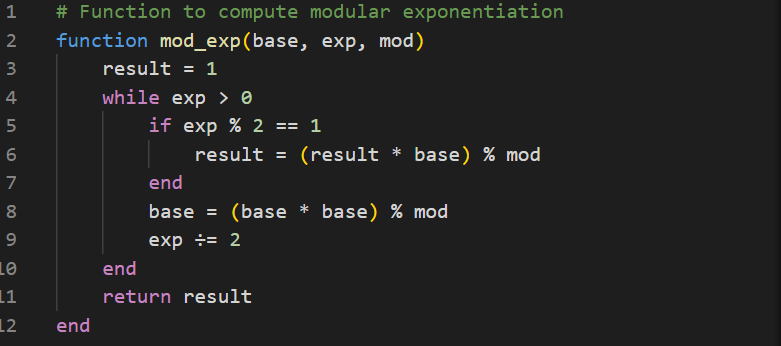
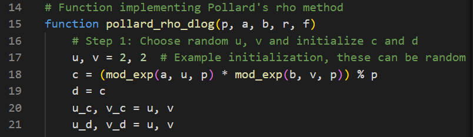
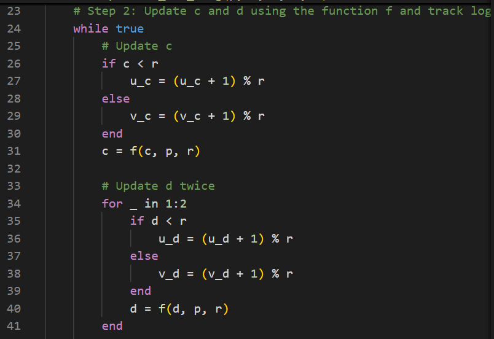
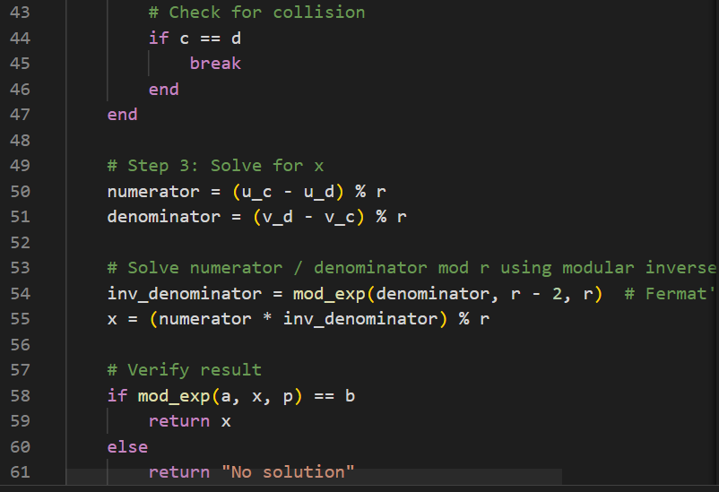
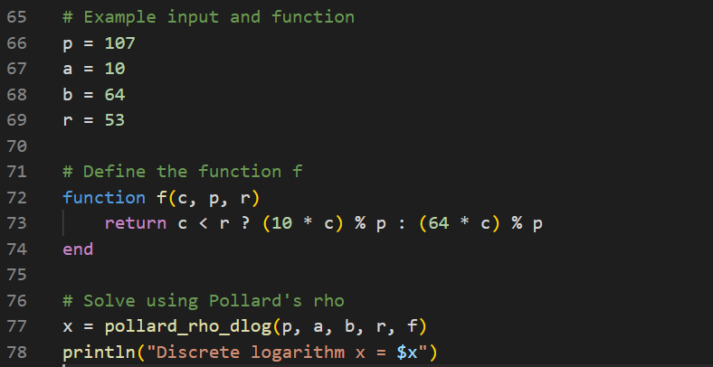
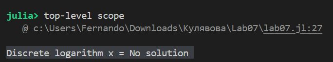

  <h1><strong>Лабораторная Pабота No 7</strong></h1>
  <h2><strong>Математические Основы Защиты Информации и Информационной Безопасности</strong></h2>
  <h2>Хосе Фернандо Леон Атупанья | НФИмд-01-24</h2>

## **Содержание**

1. Цель работы
2. Выполнение лабораторной работы
3. Выводы

## **1. Цель работы**

Ознакомиться с темой дискретного логарифмирования в конечном поле, используя материал, представленный в лабораторной работе № 7, и используя концепции, представленные в предыдущих работах, такие как модули, максимальный общий делитель и шифрование.

## **2. Выполнение лабораторной работы - Дискретное логарифмирования в конечном поле**

### *Алгоритм, реализующий p-метод Полладла для задач дискретного логарифмирования*

В этой отчете следующий код реализует p-метод Полларда для задач дискретного логарифмирования. P-метод (rho-метод Полларда) для решения задачи дискретного логарифмирования является вероятностным алгоритмом. Он эффективен для нахождения показателя степени x в a ^x ∈b(mod p), где p - простое число, a - генератор циклической группы, а b - целевое значение. Ниже приводится объяснение алгоритма.

Для начала мы вычисляем экспоненциальную модульную следующим образом: сначала мы инициализируем нашу переменную "результат" значением 1 и с помощью функции while вычисляем и проверяем, что наше входное число четное или нечетное. В зависимости от этого значение нашей переменной "результат" будет меняться

Функция pollard_rho_dlog:

Инициализирует c и d случайным значением u, v.
Обновляет c и d, используя предоставленную функцию отображения f, отслеживая изменения в u, v.
Обнаруживает коллизию (c==d).
Решает для x путем приравнивания логарифмов и использования модульной арифметики.

Функция p-метода Полларда, эта функция реализует основной алгоритм нахождения x таким образом, что:

Основная функция pollards_p_method(p, a, b, r, f) принимает в качестве входных данных:
p: число для разложения на множители.
a: Начальное значение для алгоритма
b: Начальное значение для алгоритма
f: Псевдослучайная функция сжатия.

u и v - это показатели для a и b соответственно, изначально установленные равными 2.

d также инициализируется как c.

Алгоритм использует метод "черепахи и зайца" для поиска коллизии. Обнаружение коллизий: Когда c = d, обнаруживается петля, сигнализирующая о возможном решении. 

Остаток от деления по модулю вычисляется с использованием модулярной функции, обратной c (согласно Малой теореме Ферма).Решение x проверяется путем проверки того, что a^x = b(modp).
Вычисляет дискретный логарифм x, который выводится в качестве результата.

OUTPUT:

## 3. Выводы

В этом упражнении p-метод Полларда был реализован в Julia для разложения целых чисел на множители. Алгоритм успешно продемонстрировал свою способность находить нетривиальные делители составных чисел, используя псевдослучайные итеративные обновления и свойства наибольшего общего делителя. Используя пример с p = 107, a = 10, b = 64, r = 53, алгоритм определил как нетривиальный фактор, подтверждающий его эффективность.

Это упражнение подчеркивает практическую полезность алгоритмов теории чисел в вычислительной математике, криптографии и решении задач. Кроме того, оно демонстрирует простоту реализации передовых математических методов в Julia, подчеркивая пригодность языка для решения математических и алгоритмических задач.

