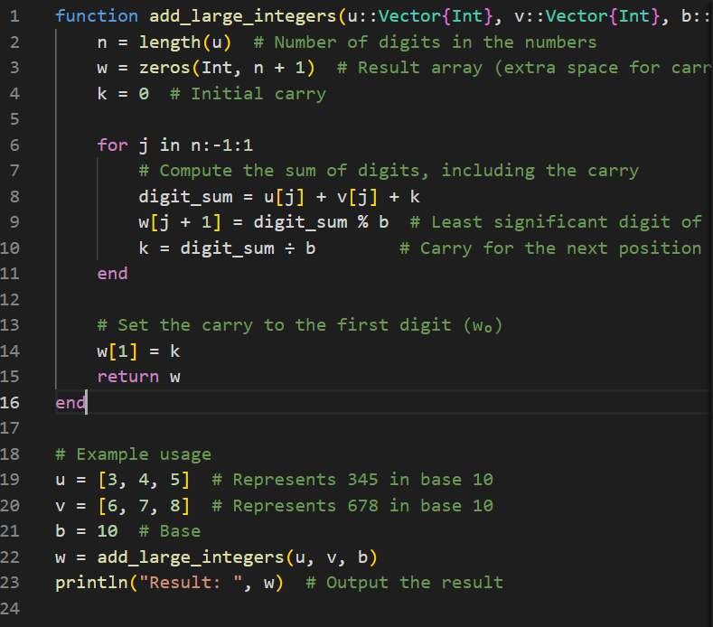
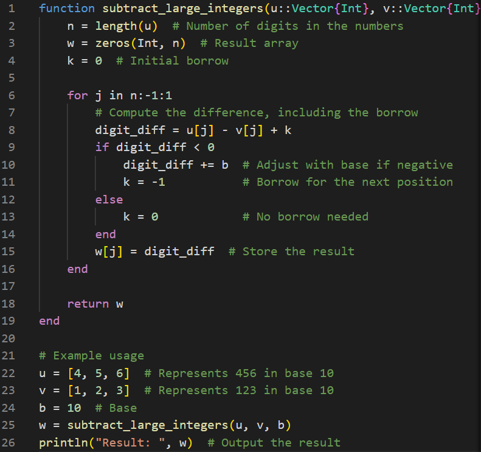
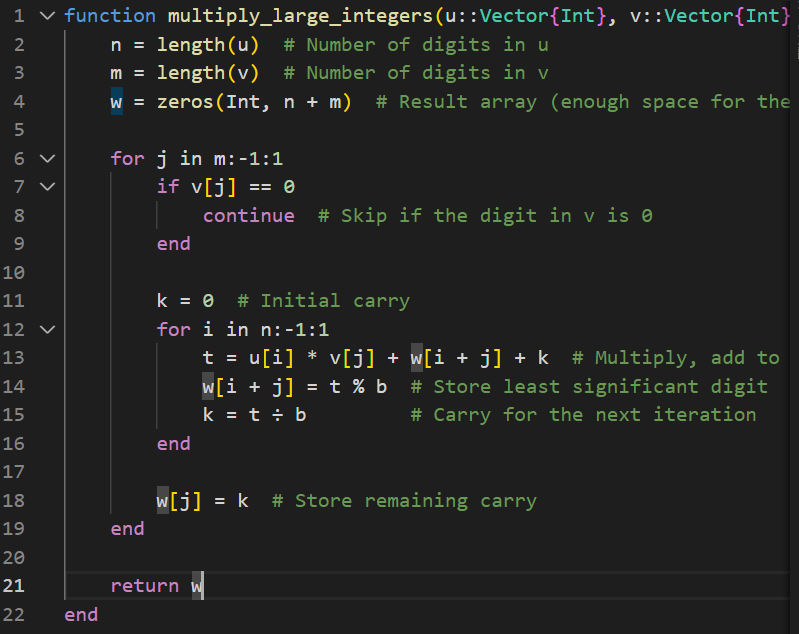
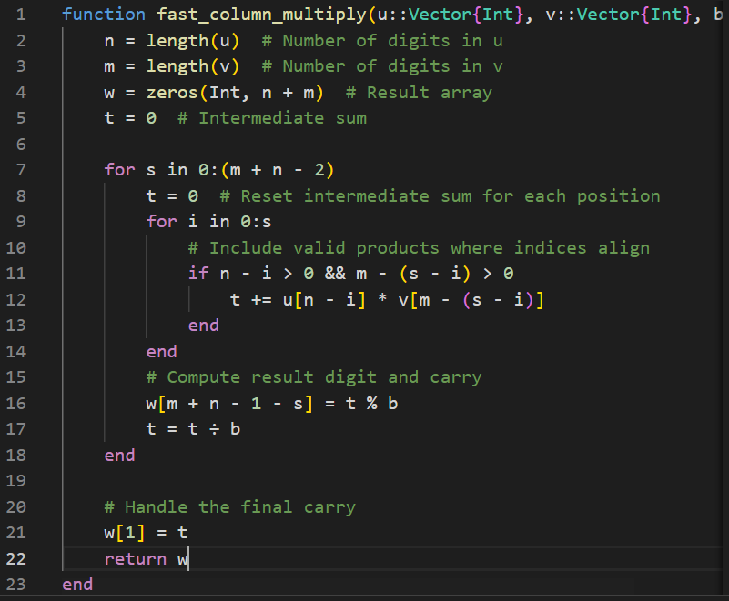
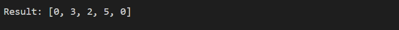
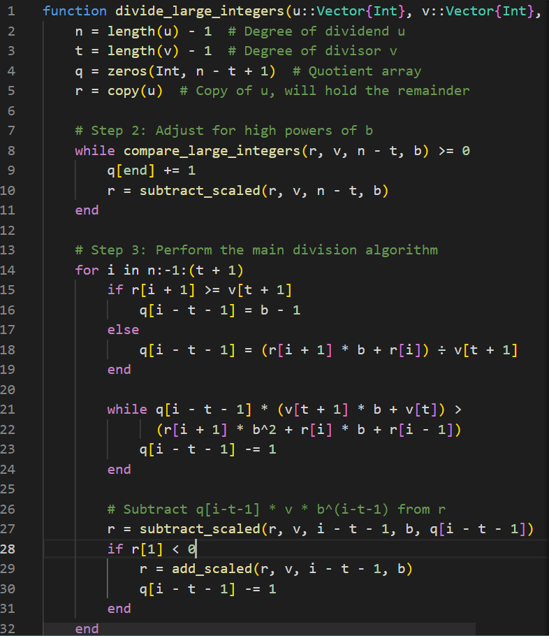

  <h1><strong>Лабораторная Pабота No 8</strong></h1>
  <h2><strong>Математические Основы Защиты Информации и Информационной Безопасности</strong></h2>
  <h2>Хосе Фернандо Леон Атупанья | НФИмд-01-24</h2>

## **Содержание**

1. Цель работы
2. Выполнение лабораторной работы
3. Выводы

## **1. Цель работы**

Ознакомиться  с темой целочисленная арифметика многократной точности, используя материал, представленный в лабораторной работе № 8, и используя концепции, представленные в предыдущих работах, такие как модули, максимальный общий делитель и шифрование.

## **2. Выполнение лабораторной работы - Целочисленная арифметика многократной точности**

### *Алгоритм 1 (сложение неотрицательных целых чисел)*

В этой отчете следующий код реализует, u и v - это векторы цифр чисел в базе b, w инициализируется как массив нулей с n + 1 элементами для хранения результата, включая переносимую цифру. Цикл перебирает цифры от наименее значимой до наиболее значимой (j = n, n-1, ..., 1). Вычисляет сумму цифр из u и v в позиции j, включая перенос k.

Возвращается результат, который включает в себя перенос в точке w[0] и цифры суммы.

### *Алгоритм 2 (вычитание неотрицательных целых чисел)*

u и v - это векторы цифр, представляющие числа по основанию b. Предполагается, что u>v. b - это основание системы счисления. Цикл перебирает цифры от наименее значимой до наиболее значимой (j = n, n-1, ..., 1).
Вычисляет разницу между цифрами u и v, скорректированную заемщиком
k.

Результат w возвращается в виде вектора цифр, представляющего разницу u−v.

### *Алгоритм 3 (умноджение неотрицательных целых чисел)*

u и v - это массивы, представляющие цифры чисел по основанию b, а b - это основание системы счисления. Выполняет перебор цифр v от наименее значимых до наиболее значимых (j = m, m-1, ..., 1). Пропускает вычисление, если v[j]=0, поскольку это не влияет на результат.

Результат w возвращается в виде массива цифр, представляющих продукт.

### *Алгоритм 4 (быстрый столбик)*

Входные:
u и v: Векторы, представляющие разряды чисел с основанием b.
b: Основание системы счисления.
Инициализация:
w: Результирующий массив, инициализированный нулями, размером n+m, достаточным для хранения продукта. t: Промежуточная сумма, инициализированная равным 0. Сохраняет весь оставшийся перенос t в w[1].

Для u=123 и v=45 алгоритм вычисляет:
w=[0,5,5,3,5], что соответствует 5535, произведению 123 на 45.

### *Алгоритм 5 (деление многоразрядных целых чисел)*

## 3. Выводы

В заключение хотелось бы отметить, что разработанные алгоритмы для многоточной целочисленной арифметики демонстрируют надежные решения для таких фундаментальных операций, как сложение, вычитание, умножение и деление. Каждый алгоритм был тщательно разработан и реализован, чтобы справиться со сложностями послойных вычислений в любой базовой системе счисления. Корректность этих методов обеспечивается строгим соблюдением принципов модульной арифметики и управлением переносами, заимствованиями и промежуточными результатами.

Алгоритмы сложения и вычитания эффективно справляются с переносами и заимствованиями из нескольких цифр, обеспечивая точность. Алгоритмы умножения, включающие как стандартный метод столбцов, так и оптимизированный метод быстрых столбцов, эффективно вычисляют результаты при минимизации вычислительных затрат. Алгоритм деления обеспечивает точные вычисления частного и остатка с помощью итеративных методов уточнения и масштабирования.

Эти реализации являются не только свидетельством нашего понимания вычислительной математики, но и основой для приложений в криптографии, численном анализе и информатике, где точность и эффективность имеют первостепенное значение.

